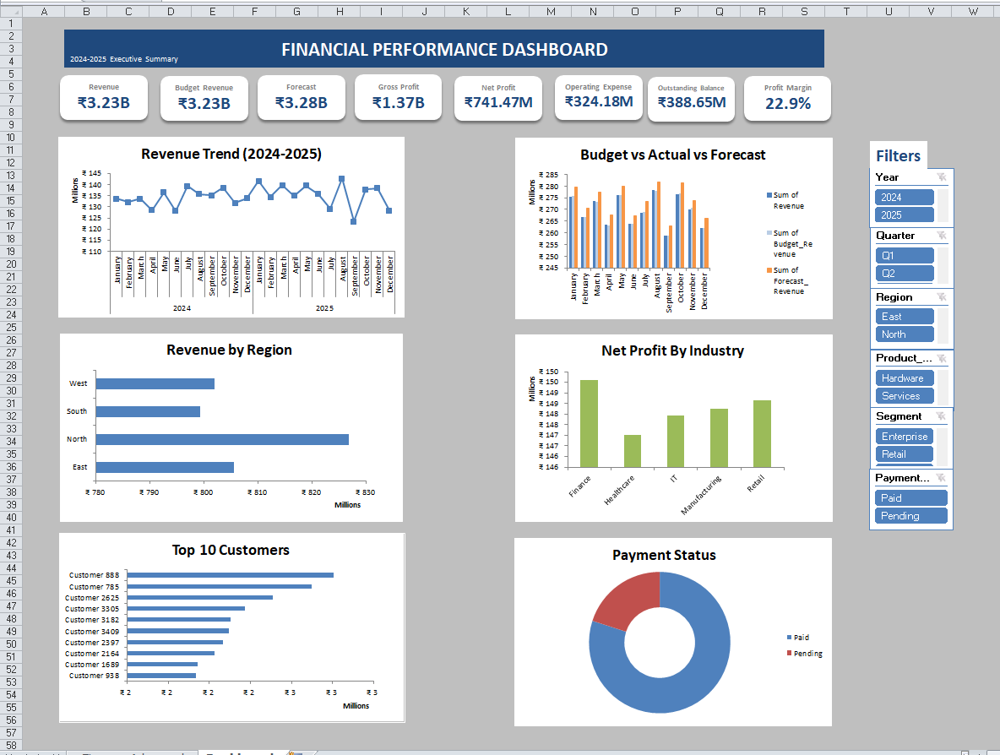

# 💰 Financial Performance Dashboard (Microsoft Excel)

## 📌 Project Overview

This project is an interactive Financial Performance Dashboard developed in Microsoft Excel to monitor and analyze an organization's financial performance.

The dashboard converts raw financial data into meaningful business insights through dynamic visualizations, KPI cards, Pivot Tables, Pivot Charts, and interactive slicers. It enables users to evaluate financial health, monitor profitability, analyze expenses, and support data-driven decision-making.

---

## 🎯 Business Objective

The dashboard helps answer important financial questions such as:

- What is the overall financial performance?
- How has revenue changed over time?
- How much profit is being generated?
- Which departments or categories contribute the most to expenses?
- How are costs distributed?
- Which period performed the best financially?
- How do financial metrics change after applying filters?

---

## 🛠 Tools & Features Used

- Microsoft Excel
- Pivot Tables
- Pivot Charts
- Slicers
- Excel Formulas
- Conditional Formatting
- KPI Cards
- Interactive Dashboard Design
- Financial Data Analysis

---

## 📊 Dashboard Preview



---

## 📈 Key Performance Indicators (KPIs)

The dashboard provides a snapshot of important financial metrics, including:

- Total Revenue
- Total Expenses
- Net Profit
- Profit Margin
- Cash Flow
- Budget Utilization
- Operating Cost
- Return on Investment (ROI)

*Note: KPIs displayed may vary depending on the selected filters.*

---

## 📊 Dashboard Components

### 📈 Revenue Trend

Tracks financial performance over time to identify growth patterns and seasonal changes.

---

### 💵 Expense Analysis

Provides a breakdown of expenses across departments, cost centers, or categories.

---

### 💰 Profit Analysis

Measures profitability across different business dimensions to identify high-performing areas.

---

### 📊 Revenue Distribution

Visualizes how revenue is generated across different segments.

---

### 💼 Financial Category Analysis

Compares financial performance across categories to identify strengths and improvement opportunities.

---

### 📅 Period-wise Financial Performance

Analyzes financial results across months or years to monitor business performance over time.

---

## 🎛 Interactive Filters

The dashboard includes dynamic slicers that allow users to filter data by:

- Year
- Month
- Department
- Category
- Region
- Business Unit

The entire dashboard updates automatically based on the selected filters.

---

## 💡 Business Insights

The dashboard enables users to:

- Monitor overall financial health.
- Compare revenue and expenses.
- Identify profitable business areas.
- Analyze cost drivers.
- Track financial performance over time.
- Support budgeting and strategic planning.
- Improve financial decision-making through interactive reporting.

---

## 📁 Project Structure

```
financial-performance-dashboard-excel/
│
├── README.md
├── Advanced Finance Dashboard.xlsx
├── LICENSE
└── images/
    ├── dashboard-overview.png
    ├── kpi-overview.png
    ├── revenue-trend.png
    ├── expense-analysis.png
    ├── profit-analysis.png
    └── filtered-dashboard.png
```

---

## 📚 Skills Demonstrated

This project demonstrates practical skills in:

- Financial Data Analysis
- Dashboard Development
- KPI Reporting
- Data Visualization
- Business Intelligence
- Financial Reporting
- Pivot Table Analysis
- Analytical Thinking
- Decision Support Reporting

---

## 🚀 Potential Business Applications

This dashboard can support:

- Finance Teams
- Financial Analysts
- Business Analysts
- Commercial Planning
- FP&A (Financial Planning & Analysis)
- Management Reporting
- Executive Decision-Making

---

## 📌 Dataset

This dashboard was created using a sample financial dataset for portfolio and learning purposes.

---

## 👤 Author

**Sahil Paruthi**

Aspiring Business Analyst
